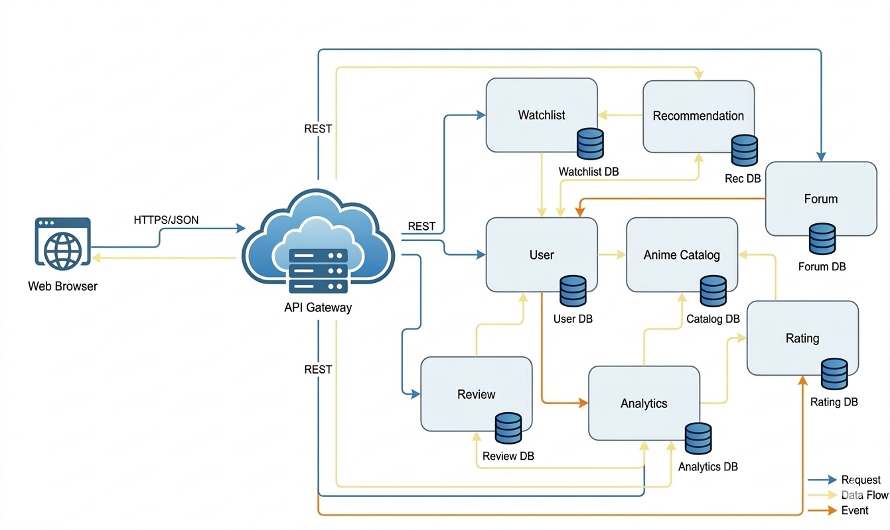

# Projeto de computacao em nuvem FCUL

### Dataset
The dataset we choose was based on an Anime dataset, available on Kaggle.

> Url: https://www.kaggle.com/datasets/dbdmobile/myanimelist-dataset

> Topic: Video animation entertainment

> Size: 7.35 GB

> Date of Release: 2023

#### Business Capabilities
We propose the following list of business capabilities:

- Catalogue infrastructure for anime series featuring attribute filtering, keyword search and show page.

- A recommendation system that suggests new anime series to users based on their activity and profile.

- User profile support featuring information such as username, location, anime watched (watchlist), among others.

- Media interaction functionality, including show reviews, user rating and forum-like threads.

- Analytics and insights derived from data statistics and user interaction.

#### Use cases
We propose the following list of use cases:
- Search for a specific anime's details.
- Look for the highest-rated anime of the season.
- Get show recommendations based on user's interests.
- Get profile information.
- Get each user's watchlist.
- Add/Remove/Update user watchlist.
- Write or read a review of the most currently most popular anime.
- Rate a show based on a fixed scale.
- Ask a question on the forum regarding the plot twist in an anime's episode or an issue with the service.
- Get the top watched animes based on a certain criteria (year, genre) and other statistics.

### Functional Requirements
The Use Cases defined in phase 1 focus on the user's goals and needs and cover only a subset of the system and its functions.Functional requirements - the focus of this phase - focus on the system's functionality and behavior; functional requirements cover the entire system and all its features and below we listed some functional requirements derived from our listed use cases (from phase 1) for our project:
- The system allows users to search for anime by title and show all the relevant details.
- The system allows users to filter anime using diferent criteria and show all the relevant details.
- The system provides a list of the highest-rated anime of the current season.
- The system displays ranking information (e.g., Top 10 or Top N) for seasonal anime.
- The system generates anime recommendations based on user watch history.
- The system generates recommendations based on user ratings.
- The system allows users to create and manage a personal profile.
- The system displays profile information
- The system allows users to view other users' public profiles.
- The system allows users to create and maintain a watchlist.
- The system allows users to add/remove anime to their watchlist.
- The system allows users to update watchlist entries
- The system allows users to write/read reviews for anime.
- The system allows users to rate anime using a fixed rating scale (e.g., 1–10).
- The system calculates and displays the average rating of each anime.
- The system allows users to post questions or discussions in a forum.
- The system allows users to comment on forum posts.
- The system allows users to search forum threads.
- The system provides top-watched anime lists.
- The system allows users to filter top anime by criteria

### Microservices Architecture
From the functional requirements listed, the system can be decomposed into multiple microservices, each responsible for a single bounded context. Listed below are some key services to be implemented in our architecture based on microservices:
1. User Service
2. Anime Catalog Service
3. Watchlist Service
4. Rating Service
5. Review Service
6. Recommendation Service
7. Forum / Discussion Service
8. Analytics / Statistics Service

