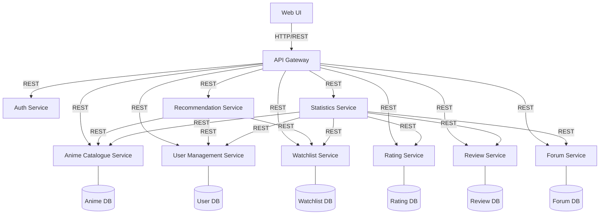

## Anime Application Architecture

```mermaid
graph TD
    UI[Web UI] -->|HTTP/REST| GW[API Gateway]

    GW -->|REST| AUTH[Auth Service]
    GW -->|REST| ANIME[Anime Catalogue Service]
    GW -->|REST| USER[User Management Service]
    GW -->|REST| WATCH[Watchlist Service]
    GW -->|REST| RATE[Rating Service]
    GW -->|REST| REV[Review Service]
    GW -->|REST| FORUM[Forum Service]
    GW -->|REST| REC[Recommendation Service]
    GW -->|REST| STATS[Statistics Service]

    REC -->|REST| ANIME
    REC -->|REST| WATCH
    REC -->|REST| USER

    STATS -->|REST| ANIME
    STATS -->|REST| USER
    STATS -->|REST| WATCH
    STATS -->|REST| RATE
    STATS -->|REST| REV
    STATS -->|REST| FORUM

    ANIME --- DB1[(Anime DB)]
    USER --- DB2[(User DB)]
    WATCH --- DB3[(Watchlist DB)]
    RATE --- DB4[(Rating DB)]
    REV --- DB5[(Review DB)]
    FORUM --- DB6[(Forum DB)]
```