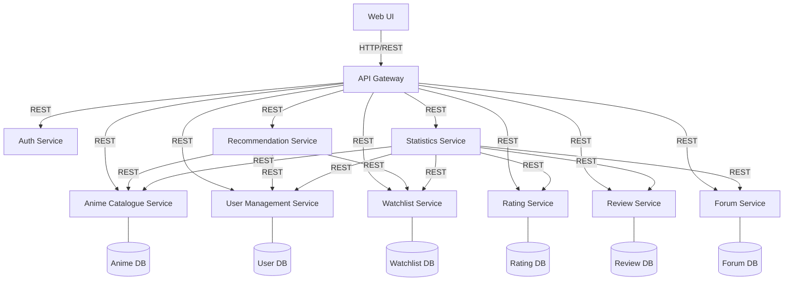

### Functional Requirements
The Use Cases defined in phase 1 focus on the user's goals and needs and cover only a subset of the system and its functions. Functional requirements - the focus of this phase - focus on the system's functionality and behavior. Functional requirements cover the entire system and all its features. Below we list some functional requirements derived from our listed use cases (from phase 1) for our project. The expression «all users» includes unauthenticated users.

Anime Catalogue Service – Functional Requirements
- The system allows all users to search for anime by title and returns all relevant details matching the input.
- The system allows all users to filter anime using different criteria and returns all matching details.

Analytics Service – Functional Requirements
- The system innately provides a list of the highest-rated anime of the current season.
- The system innately provides most-watched anime lists.
- The system provides information about recent trends (e.g most-watched anime all belong to same studio, etc).
- The system allows all users to filter top anime by criteria.

Recommendation Service – Functional Requirements
- The system generates anime recommendations based on user watch history.
- The system generates recommendations based on user ratings.
- The system generates recommendations based on user reviews.

User Service – Functional Requirements
- The system allows users to create and manage a personal profile.
- The system displays the user profile information.
- The system allows users to view other users' public profiles.

Watchlist Service – Functional Requirements
- The system allows users to create and maintain a personal watchlist.
- The system allows users to add/remove anime from their watchlist.
- The system allows users to update watchlist entries.

Review Service – Functional Requirements
- The system allows authenticated users to write a review for a specific anime.
- The system allows users to edit/delete their own reviews.
- The system allows users to view all reviews associated with a specific anime.
- The system ensures that each review is associated with a valid anime.
- The system ensures that each review is linked to the user who created it.

Rating Service – Functional Requirements
- The system allows users to rate anime using a fixed rating scale (e.g., 1–10).
- The system calculates and displays the average rating of each anime.

Forum / Discussion Service – Functional Requirements
- The system allows authenticated users to create discussion posts about anime.
- The system allows all users to view all forum posts.
- The system allows authenticated users to comment on discussion posts.
- The system allows authenticated users to reply to existing comments.
- The system allows authenticated users to delete their own posts/comments.
- The system allows all users to search for forum posts based on keywords.

### Microservices Architecture
From the functional requirements listed, the system can be decomposed into multiple microservices, each responsible for a single bounded context. Listed below are some key services to be implemented in our architecture based on microservices.
1. Authentication Service - Tells each other service who can do what
2. User Service - Defines basis for user activity
3. Anime Catalog Service - Contains all existing anime and show related information
4. Watchlist Service - Enables users to manage watch history details
5. Rating Service - Adds user-based ranking functionality to shows
6. Review Service - Provides a user-based show critique system
7. Recommendation Service - Provides a curated list of anime based on user activity
8. Forum / Discussion Service - Enables discussion threads regarding anime or the system
9. Analytics / Statistics Service - Tracks trends and highlights pertinent patterns in the data

## Anime Application Architecture

