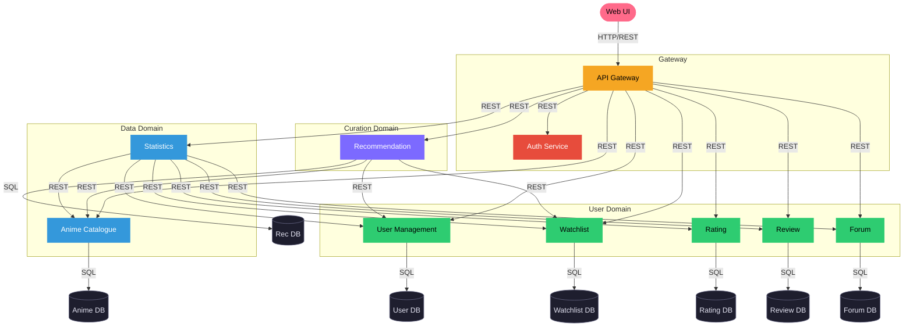

# Cloud Computing: Group 12's Phase 1

## Dataset: MyAnimeList Dataset (Anime Database)

- **URL:** https://www.kaggle.com/datasets/dbdmobile/myanimelist-dataset?select=anime-dataset-2023.csv  
- **Topic:** Anime / Entertainment  
- **Size:** 7.35 GB  
- **Publication / Last Update:** Updated 3 years ago (according to Kaggle metadata)

---

# Business Capabilities

We propose the following business capabilities:

- Catalogue infrastructure for anime series featuring attribute filtering, keyword search, and detailed show pages.
- A recommendation system that suggests new anime series to users based on their activity and profile.
- User profile support including username, location, and personal watchlist.
- Media interaction functionality, including reviews, ratings, and forum-like discussion threads.
- Analytics and insights derived from dataset statistics and user interaction.

---

# Use Cases (Our Contributions)

We propose the following use cases:

- Search for a specific anime's details.
- Get the highest-rated anime of the season.
- Get show recommendations based on user interests.
- Retrieve profile information.
- View a user's watchlist.
- Add, remove, or update entries in a user watchlist.
- Write or read a review of the currently most popular anime.
- Rate a show based on a fixed scale.
- Post a question in the forum regarding a plot twist or service issue.
- Get a studio's most popular anime shows of all time.

## Anime Application Architecture
